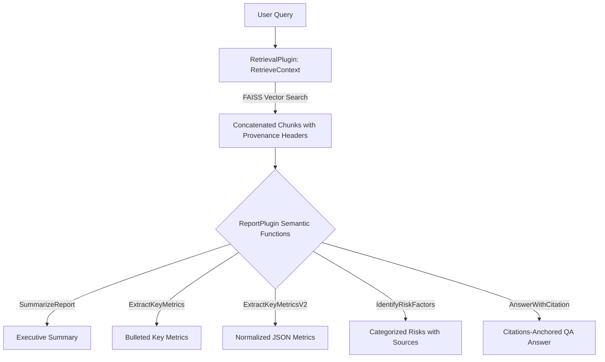

# Semantic Kernel Plugins & Skills Catalog

This document serves as the developer reference for all semantic functions (prompts) and native plugins registered within the `semantic_kernel_ollama_project` RAG pipeline.

---

## 📐 Pipeline Architecture

The workflow leverages a hybrid system combining native Python execution for similarity search and semantic functions for text processing.



---

## 🛠️ Plugins & Functions Catalog

### 1. Native Plugin: `RetrievalPlugin`
Defined inside [retrieval_plugin.py](file:///c:/Users/angel/projects/rag-company-report-analyzer/semantic_kernel_ollama_project/retrieval_plugin.py).

*   **Function Name**: `RetrieveContext`
*   **Description**: Queries the local FAISS index for passages relevant to a text query. It formats context chunks with unique provenance markers (`[Chunk N | Page P | score S]`) to enable precise citing downstream.
*   **Inputs**:
    *   `query` (string, required): The search query to match against embedded document passages.
*   **Returns**: Concatenated context blocks separated by `---` dividers.

---

### 2. Semantic Plugin: `ReportPlugin`
Located under the [plugins/ReportPlugin](file:///c:/Users/angel/projects/rag-company-report-analyzer/semantic_kernel_ollama_project/plugins/ReportPlugin) directory.

#### A. `SummarizeReport`
*   **Location**: [SummarizeReport/skprompt.txt](file:///c:/Users/angel/projects/rag-company-report-analyzer/semantic_kernel_ollama_project/plugins/ReportPlugin/SummarizeReport/skprompt.txt) | [SummarizeReport/config.json](file:///c:/Users/angel/projects/rag-company-report-analyzer/semantic_kernel_ollama_project/plugins/ReportPlugin/SummarizeReport/config.json)
*   **Description**: Summarizes company documents, highlighting financial highlights, operational updates, and key strategies.
*   **Inputs**:
    *   `input` (string, required): Context chunks outputted by the retrieval plugin.

#### B. `ExtractKeyMetrics`
*   **Location**: [ExtractKeyMetrics/skprompt.txt](file:///c:/Users/angel/projects/rag-company-report-analyzer/semantic_kernel_ollama_project/plugins/ReportPlugin/ExtractKeyMetrics/skprompt.txt) | [ExtractKeyMetrics/config.json](file:///c:/Users/angel/projects/rag-company-report-analyzer/semantic_kernel_ollama_project/plugins/ReportPlugin/ExtractKeyMetrics/config.json)
*   **Description**: Extracts raw numerical data and performance metrics into a clean bulleted list.
*   **Inputs**:
    *   `input` (string, required): Context chunks.

#### C. `ExtractKeyMetricsV2`
*   **Location**: [ExtractKeyMetricsV2/skprompt.txt](file:///c:/Users/angel/projects/rag-company-report-analyzer/semantic_kernel_ollama_project/plugins/ReportPlugin/ExtractKeyMetricsV2/skprompt.txt) | [ExtractKeyMetricsV2/config.json](file:///c:/Users/angel/projects/rag-company-report-analyzer/semantic_kernel_ollama_project/plugins/ReportPlugin/ExtractKeyMetricsV2/config.json)
*   **Description**: Performs advanced data normalization to output a strict JSON list representing key financial metrics.
*   **JSON Schema**:
    ```json
    [
      {
        "category": "Revenue / Profitability / Balance Sheet / Operations",
        "metric_name": "Name of the metric",
        "value": 0.00,
        "unit": "USD / EUR / %, etc.",
        "period": "Q3 2024 / FY 2023",
        "comparison_prior_period": "Increase of X% YoY / flat / down",
        "source_chunks": [1, 3]
      }
    ]
    ```
*   **Inputs**:
    *   `input` (string, required): Context chunks.

#### D. `IdentifyRiskFactors`
*   **Location**: [IdentifyRiskFactors/skprompt.txt](file:///c:/Users/angel/projects/rag-company-report-analyzer/semantic_kernel_ollama_project/plugins/ReportPlugin/IdentifyRiskFactors/skprompt.txt) | [IdentifyRiskFactors/config.json](file:///c:/Users/angel/projects/rag-company-report-analyzer/semantic_kernel_ollama_project/plugins/ReportPlugin/IdentifyRiskFactors/config.json)
*   **Description**: Scans the context to compile a categorized list of company risks and challenges.
*   **JSON Schema**:
    ```json
    {
      "risk_factors": [
        {
          "category": "Operational / Financial / Regulatory / Macroeconomic",
          "description": "Specific risk description",
          "potential_impact": "High / Medium / Low",
          "mitigation_actions": "Actions noted (or null if unspecified)",
          "source_chunks": [2, 5]
        }
      ]
    }
    ```
*   **Inputs**:
    *   `input` (string, required): Context chunks.

#### E. `AnswerWithCitation`
*   **Location**: [AnswerWithCitation/skprompt.txt](file:///c:/Users/angel/projects/rag-company-report-analyzer/semantic_kernel_ollama_project/plugins/ReportPlugin/AnswerWithCitation/skprompt.txt) | [AnswerWithCitation/config.json](file:///c:/Users/angel/projects/rag-company-report-analyzer/semantic_kernel_ollama_project/plugins/ReportPlugin/AnswerWithCitation/config.json)
*   **Description**: Answers user questions using only the retrieved context, suffixing every assertion with exact `[Source: chunk N, page P]` markers.
*   **Inputs**:
    *   `input` (string, required): Context chunks.
    *   `question` (string, required): The user's question.

---

## 💻 Code Example: Registration and Invocation

Here is how you register and chain these skills inside [main.py](file:///c:/Users/angel/projects/rag-company-report-analyzer/semantic_kernel_ollama_project/main.py):

```python
import os
import asyncio
from semantic_kernel import Kernel
from retrieval_plugin import RetrievalPlugin

async def main():
    kernel = Kernel()
    
    # 1. Register the native Retrieval Plugin
    retrieval_plugin = RetrievalPlugin(vector_store=my_vector_store)
    kernel.add_plugin(retrieval_plugin, plugin_name="RetrievalPlugin")
    
    # 2. Register semantic functions under 'plugins/ReportPlugin'
    plugins_dir = os.path.join(os.path.dirname(__file__), "plugins")
    report_plugin = kernel.add_plugin(parent_directory=plugins_dir, plugin_name="ReportPlugin")
    
    # 3. Retrieve Context (Native Execution)
    retrieve_func = kernel.get_function("RetrievalPlugin", "RetrieveContext")
    context = await kernel.invoke(retrieve_func, query="What are the operational risks?")
    
    # 4. Generate Answer with Citations (Semantic Execution)
    answer_func = kernel.get_function("ReportPlugin", "AnswerWithCitation")
    result = await kernel.invoke(
        answer_func, 
        input=str(context), 
        question="What are the operational risks?"
    )
    print(result)

if __name__ == "__main__":
    asyncio.run(main())
```

---

## ➕ How to Create a New Semantic Skill

To add a new semantic skill to this project:
1. Create a new directory under [plugins/ReportPlugin](file:///c:/Users/angel/projects/rag-company-report-analyzer/semantic_kernel_ollama_project/plugins/ReportPlugin) with your skill's name (e.g., `IdentifyOpportunities`).
2. Add a `skprompt.txt` file containing your system prompt and inputs (e.g., `{{$input}}`).
3. Add a `config.json` containing the schema version, parameters, descriptions, and prompt configuration.
4. Run your test suites to ensure proper loading:
   ```bash
   pytest semantic_kernel_ollama_project/tests/
   ```
